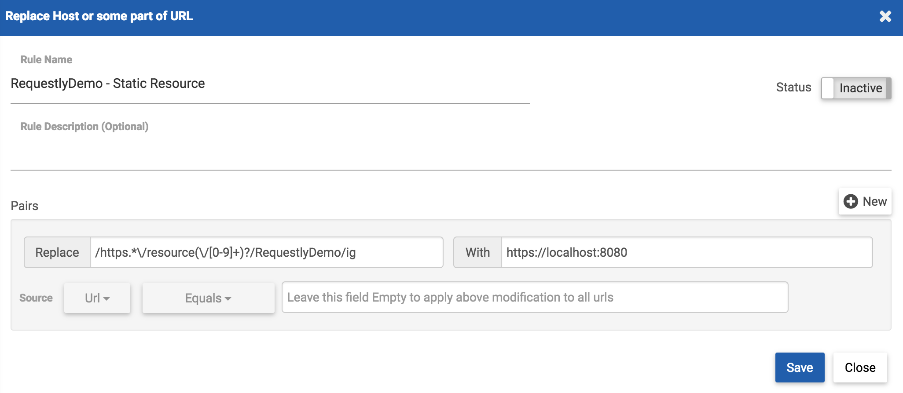
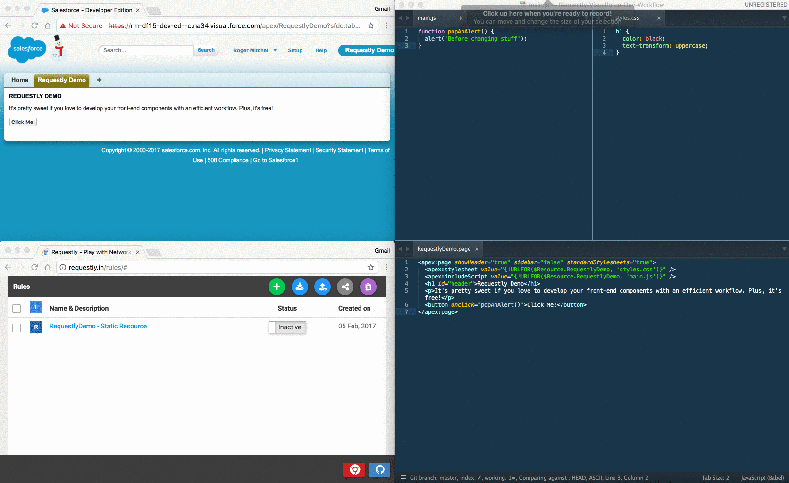

# Using Requestly in Visualforce Development Workflow
It's time that front-end dev workflow on Salesforce gets an efficiency boost. If you've developed any front-end assets on localhost, you may know how incredible it is to use tooling like [Gulp](http://gulpjs.com/), [Grunt](http://gruntjs.com/), and most recently [Webpack](https://webpack.js.org/); updating a function in your JS or changing a style in your CSS causes the page to reload, and you continue forward with development.

A nearly identical workflow is possible with our Visualforce development workflow by using a static resource bundle, a Chrome extension called [Requestly](http://requestly.in/), and our task runner of choice (in this case, [Webpack Dev Server](https://webpack.js.org/configuration/dev-server/)).

## Prerequisites
In order to benefit from developing and serving our front-end components on localhost, we'll need to have a few things set up first.

1. `cd` to our project's root folder
1. `npm init` and `npm install webpack-dev-server --save-dev`
1. Ensure we leverage a static resource the page's JS/CSS and this is unpacked as a static resource bundle in the IDE

## Setting Up Webpack Dev Server
Now that we have `webpack-dev-server` installed, we can run a command with Terminal to specify from where we should serve our files. Note that you'll want to replace the **`resource-bundles/RequestlyDemo.resource`** with your static resource bundle that appears in your project folder before running the command.

Run `webpack-dev-server --content-base resource-bundles/RequestlyDemo.resource --https` in our project folder.

## Setting Up Requestly
Our files are now served on localhost, so we can use [Requestly]() to replace requests to Salesforce's copy of the static resource to our localhost version. Open the Requestly extension by visiting the [rules page](http://requestly.in/rules) and click the **+** icon to create a new rule. We'll use the **Replace Host** configuration.

Pop back to our Visualforce page and open Chrome Dev Tools. We'll inspect the Sources tab to grab the URL that Salesforce has for our server side static resource.

Within Requestly, we'll drop the base URL for the static resource into our **Replace** option, and specify our localhost and port as the **With** option. Click **Save** and ensure that the rule is toggled as **Active**.

## Using Within a Development Workflow
After saving a change to your local CSS and JS files, refresh the Visualforce page and see the changes implemented. This saves time from deploying the static resource bundle and dealing with any lags with the Tooling and Metadata APIs. Also, creating these changes in localhost can allow other users to test features on the page as you continue development of an additional feature.

Note that in the demo above, the page did not initially reflect changes made to `main.js` and `styles.css`. By inspecting the sources, it appears the number scheme changed for our server-side static resource. By updating the Requestly rule, we can move forward with our chnages.

I'd love to hear your thoughts about how this can save time in your workflow, and if you have any other tips and tricks to share. Drop a comment below or [@RogerMitchell](https://www.twitter.com/rogermitchell).